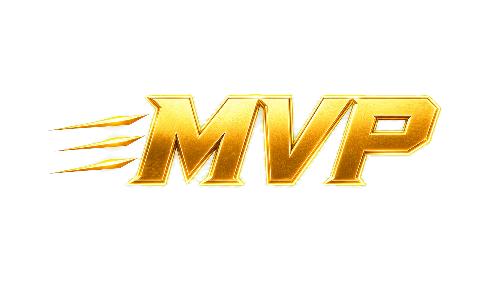

# SwiftMvpEffect

**English** | [简体中文](README_CN.md)

A SwiftlyS2 round-MVP screen-particle plugin built on the proven Swift Particle
Menu architecture. When CS2 emits the `round_mvp` event, the plugin creates an
owner-only `info_particle_system` for each target viewer and plays a transparent
gold MVP emblem. Position, scale bounce, and fading are calculated locally on
the client from the VPCF collection lifetime; the server only creates and cleans
up the entities.

The previously validated 60-frame sequence-atlas gold MVP banner is also kept as
a separate test effect. It adds no rendering cost to the default `round_mvp`
path and is created only by its dedicated test command.



## Demo

[Watch the in-game MVP effect demo (MP4)](docs/mvp_effect_demo.mp4)

The video is documentation media only. It is not included in the Source 2 asset
build or the override VPK.

## Features

- Automatically listens for `round_mvp`.
- Shows the effect to all online players by default, or only to the MVP player
  when configured.
- Provides the `swift_mvp_test` single-player test command.
- Provides `swift_mvp_test_atlas` for the preserved 60-frame, 25 FPS
  sequence-atlas banner.
- Generates the transparent MVP emblem, VTEX, and VPCF automatically.
- Generates 60 512×512 carrier frames, an MKS file, a lossless 4096 atlas, and a
  separate VPCF from the original 60-frame ZIP.
- Converts the transparent source image into a 1024×1024 transparent carrier and
  lossless 1024 texture to reduce first-display overhead significantly.
- Uses a default `scale` of `0.50`; the client slides the emblem in from the
  left, applies a small bounce, holds it in the center, and accelerates it out to
  the right.
- Uses independent transmit state for every viewer and explicitly hides the
  effect from all other players.
- Cleans up idempotently on repeated triggers, disconnect, the next round, and
  plugin unload.
- Includes strict Source 2 resource build and verification scripts.

## Configuration

Edit `mvp_effect.json` in the plugin directory:

```json
{
  "enabled": true,
  "audience": "all",
  "scale": 0.50,
  "offsetY": 0.04
}
```

`audience` accepts:

- `all`: every online player.
- `mvp`: only the MVP player.

The configuration is read when the plugin loads. Reload the plugin after making
changes.

## Build

```powershell
pwsh -NoProfile -File .\tools\generate_assets.ps1
dotnet restore --ignore-failed-sources
pwsh -NoProfile -File .\tools\verify.ps1
```

Compile the Source 2 resources with CS2 Workshop Tools installed:

```powershell
pwsh -NoProfile -File .\tools\build_source2_assets.ps1 -Force
```

The default addon namespace is `swift_mvp_effect`. The important compiled files
are:

```text
game/csgo_addons/swift_mvp_effect/
  materials/swift_mvp_effect/mvp_animation_60f.vtex_c
  materials/swift_mvp_effect/mvp_emblem.vtex_c
  particles/swift_mvp_effect/mvp_atlas_overlay.vpcf_c
  particles/swift_mvp_effect/mvp_overlay.vpcf_c
```

`dotnet publish -c Release` writes the plugin DLL and `mvp_effect.json` to:

```text
build/publish/SwiftMvpEffect/
```

## Deployment notes

The client and server must mount the same compiled resources. Restart both the
client and server after updating resources or the VPK; hot-reloading only the DLL
does not refresh cached VTEX/VPCF resources on the client.

### Distribution channels (important)

The current `gameinfo.gi + overrides/*.vpk` workflow is for local development,
test-server integration, and pre-release acceptance testing only. It is not the
final player-facing distribution method. Production players should not be asked
to edit `gameinfo.gi` or copy a local VPK manually.

| Scenario | Particle resource delivery | SwiftlyS2 plugin delivery |
|---|---|---|
| Local development/test server | Mount `swift_mvp_effect.vpk` in `overrides` on both the client and server | The deployment script copies the DLL and configuration to the test server |
| Production release | Upload the reviewed compiled resources as CS2 Workshop content and update them through the Workshop project | The server owner deploys the DLL and configuration separately; they are not included in the Workshop resource pack |

Expected production release process:

1. Confirm asset rights, the addon namespace, and version information.
2. Use this project's verification and Source 2 compilation workflow to generate
   VTEX_C and VPCF_C files.
3. Create a Workshop payload containing only approved release resources. Do not
   include private source assets, development scripts, local paths, server
   configuration, or the SwiftlyS2 DLL.
4. Create or update the production item through CS2 Workshop Tools/Steam
   Workshop, recording the Workshop Item ID, release version, and change notes.
5. Configure the production server to subscribe to or download the Workshop
   content, while deploying `SwiftMvpEffect.dll` and `mvp_effect.json` separately.
6. On a clean client, verify Workshop download, resource precaching, automatic
   MVP triggering, and two-client transmit isolation. Restart both client and
   server after resource updates.
7. Switch from the test override environment to Workshop distribution only after
   acceptance passes; do not treat the local `gameinfo.gi` edit as a production
   installation step.

This repository does not yet include a Workshop upload script or a production
Item ID. Add them only after the publishing account, Workshop project, and asset
authorization are confirmed. The VPK scripts remain available for rapid
integration testing and pre-release resource acceptance.

### One-command override test deployment (development/acceptance only)

The default paths match the current Swift Particle Menu test environment:

```powershell
pwsh -NoProfile -ExecutionPolicy Bypass `
  -File .\build_and_deploy.ps1 `
  -ForceAssetRebuild
```

The script performs these steps:

1. Runs offline resource and C# verification.
2. Publishes `SwiftMvpEffect.dll` and its configuration.
3. Compiles two VTEX_C and two VPCF_C files.
4. Packages only those four `_c` files into `swift_mvp_effect.vpk`.
5. Verifies VPK checksums, the CS2 v2 single-file container header (with no
   archive-MD5 chunk section), and the extracted file list.
6. Installs the same VPK on the client and dedicated server.
7. Backs up and updates `gameinfo.gi` SearchPaths on both sides. On the server,
   `Game csgo/addons/swiftlys2` is kept ahead of every override VPK so the test
   pack cannot shadow SwiftlyS2 server resources.
8. Deploys the SwiftlyS2 plugin and compares the SHA-256 hashes of the VPK, DLL,
   and configuration.

After deployment, fully restart the client and server, then run these commands in
the game console:

```text
swift_mvp_test
swift_mvp_test_atlas
```

Verify an existing deployment without rebuilding it:

```powershell
pwsh -NoProfile -File .\tools\verify_deployment.ps1
```

Remove the test mount, VPKs on both sides, and the server plugin:

```powershell
pwsh -NoProfile -File .\tools\uninstall_test_deployment.ps1
```

The uninstall script removes only this project's exact paths and creates a
timestamped backup before editing `gameinfo.gi`.

The server SearchPaths must retain this priority; other existing override packs
may remain:

```text
Game_LowViolence  csgo_lv
Game              csgo/addons/swiftlys2
Game              csgo/overrides/<existing-test-pack>.vpk
Game              csgo/overrides/swift_mvp_effect.vpk
Game              csgo
```

Deployment verification rejects a server configuration where
`csgo/addons/swiftlys2` appears after any override VPK.

## Architecture sources

- `bj`: sequence atlas, screen overlay, CP assignment, and pre-Start
  configuration.
- `ptext`: independent sessions and transmit isolation after connection changes.
- `smb`: multi-entity lifecycle and failure cleanup.

The MVP effect writes CP34 once at startup (`x=scale`, `z=offsetY`). A single
VPCF uses `PF_TYPE_COLLECTION_AGE` to drive 13 continuous renderer intervals:
the emblem enters from the left and bounces from 0–0.52 seconds, holds in the
center from 0.52–1.62 seconds, accelerates out to the right from 1.62–2.24
seconds, and completes its fade off-screen. `m_flRadiusScale` provides the entry
bounce and exit shrink, while `C_OP_FadeInSimple` and `C_OP_FadeOutSimple`
control particle alpha. No per-tick server control-point replication is needed,
and the effect has no black background. The default VPCF uses a static
transparent texture; the atlas VPCF follows the same movement contract and plays
the same 60-frame sequence in each active renderer with
`ANIMATION_TYPE_FIT_LIFETIME` at 25 FPS.
