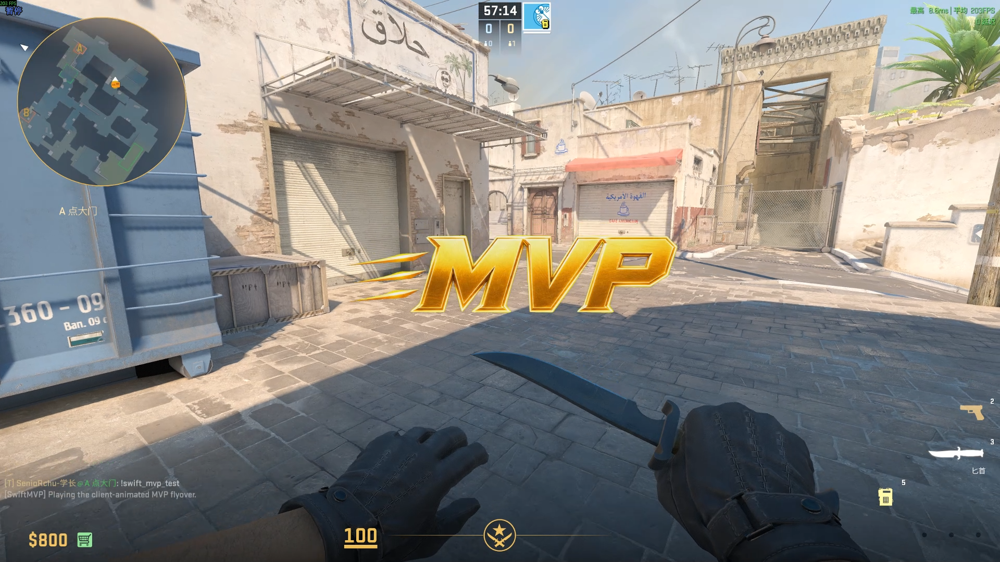

# SwiftMvpEffect

[English](README.md) | **简体中文**

一个在 CS2 触发 `round_mvp` 时展示客户端动画 MVP 粒子 overlay 的 SwiftlyS2
插件。每名观看者拥有独立可见的效果，服务器只负责创建、可见性控制与清理。

## 演示

[](docs/mvp_effect_demo.mp4)

<video controls preload="metadata" poster="docs/mvp_effect_demo_poster.png" width="960">
  <source src="docs/mvp_effect_demo.mp4" type="video/mp4">
  当前 Markdown 查看器不支持内嵌视频。
  <a href="docs/mvp_effect_demo.mp4">打开 MP4 演示</a>。
</video>

[打开或下载游戏内演示（MP4）](docs/mvp_effect_demo.mp4)

## 核心特点

- 自动响应 `round_mvp`。
- 可向所有玩家展示，也可只向 MVP 玩家展示。
- 为每名观看者提供 owner-only transmit 隔离。
- 移动、缩放与淡入淡出全部由客户端本地计算。
- 包含默认透明 MVP 主视觉与可选的 60 帧 atlas 测试效果。
- 重复触发、断线、回合开始与卸载时均可安全清理。
- 提供 Source 2 资源生成、验证和测试部署自动化。

## 快速开始

需要 .NET 10、PowerShell 7+、SwiftlyS2.CS2 1.4.3；编译游戏资源时还需要
CS2 Workshop Tools。

```powershell
pwsh -NoProfile -File .\tools\generate_assets.ps1
dotnet restore --ignore-failed-sources
pwsh -NoProfile -File .\tools\verify.ps1
```

Source 2 编译、测试部署、SearchPaths 与 Workshop 发布说明请查看
[技术指南](docs/TECHNICAL_GUIDE_CN.md)。

## 配置

插件启动时读取 `mvp_effect.json`。配置支持启用/禁用效果、选择向 `all` 或 `mvp`
展示，以及调整缩放和纵向偏移；修改后需要重载插件。

[配置参考](docs/TECHNICAL_GUIDE_CN.md#配置)

## 测试命令

| 命令 | 用途 |
|---|---|
| `swift_mvp_test` | 为单名玩家播放默认透明 MVP 效果 |
| `swift_mvp_test_atlas` | 播放保留的 60 帧 atlas 版本 |

## 文档

- [技术指南](docs/TECHNICAL_GUIDE_CN.md)：架构、资源流水线、构建、验证、部署与正式
  发布。
- [English technical guide](docs/TECHNICAL_GUIDE.md)。
- [第三方素材说明](THIRD_PARTY_ASSETS.md)：源素材及再分发注意事项。

## 发布说明

现有 `gameinfo.gi + overrides/*.vpk` 流程只用于本地开发、测试服与发布前验收。
正式粒子资源应通过 CS2 Workshop 分发；SwiftlyS2 DLL 与配置仍由服主单独部署。
